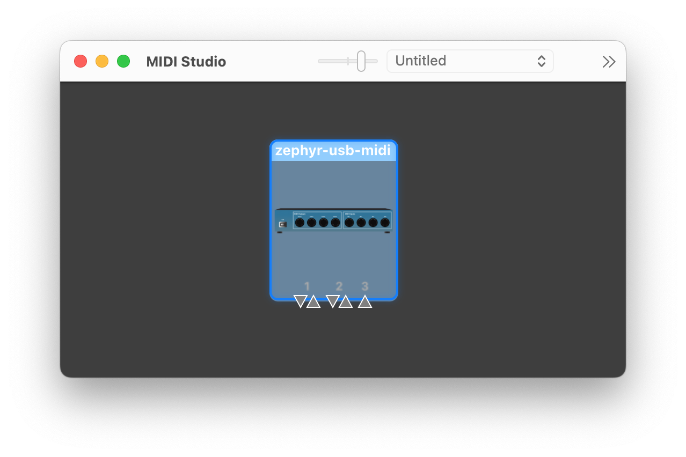

This repo contains a [Zephyr](https://zephyrproject.org/) implementation of the [USB MIDI device class](https://www.usb.org/sites/default/files/midi10.pdf) along with a small test app. As the name suggests, this lets a device running Zephyr send and receive [MIDI](https://en.wikipedia.org/wiki/MIDI) data over USB following a widely supported standard.

The code is still work in progress, but the goal is to get it in good enough shape to submit a PR to mainline Zephyr. Any help to achieve this goal would be greatly appreciated, for example

* testing on different boards
* testing compatibility with different host operating systems
* finding, reporting and fixing bugs
* suggesting or implementing improvements

## What works and what doesn't

Creating a USB MIDI device with a configurable number of input and output ports 

For known issues and missing features, see the [issue tracker](issues).

## Usage

See the public API defined in [usb_midi.h](src/usb_midi.h).

## Configuration options

### USB MIDI options

* `CONFIG_USB_MIDI_NUM_INPUTS` - The number of input ports. Between 0 and 16 (inclusive). Defaults to 1.
* `CONFIG_USB_MIDI_NUM_OUTPUTS` - The number of output ports. Between 0 and 16 (inclusive). Defaults to 1.

### Generic USB options

## Development

Statically allocated

Finally, here's a list of random gotchas

* remove macos device to refresh outputs/inputs

Macos

* midikeys
* midimonitor
* midi studio